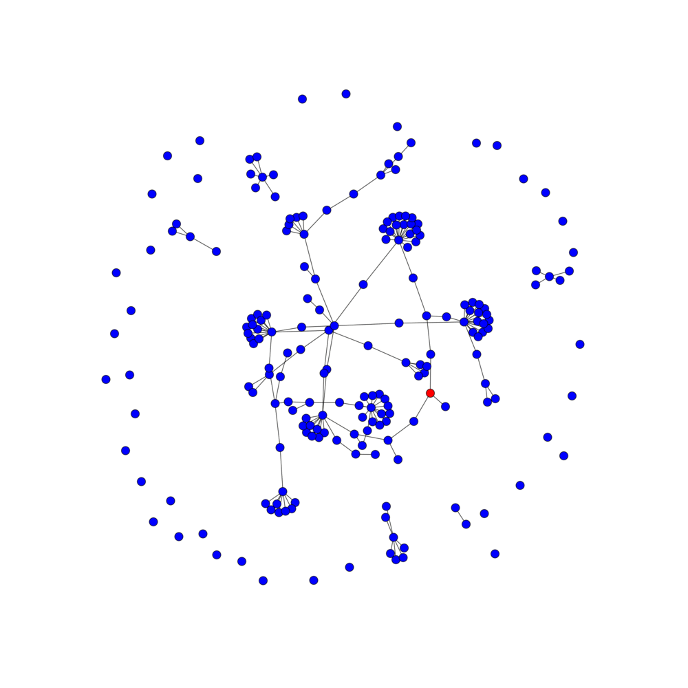
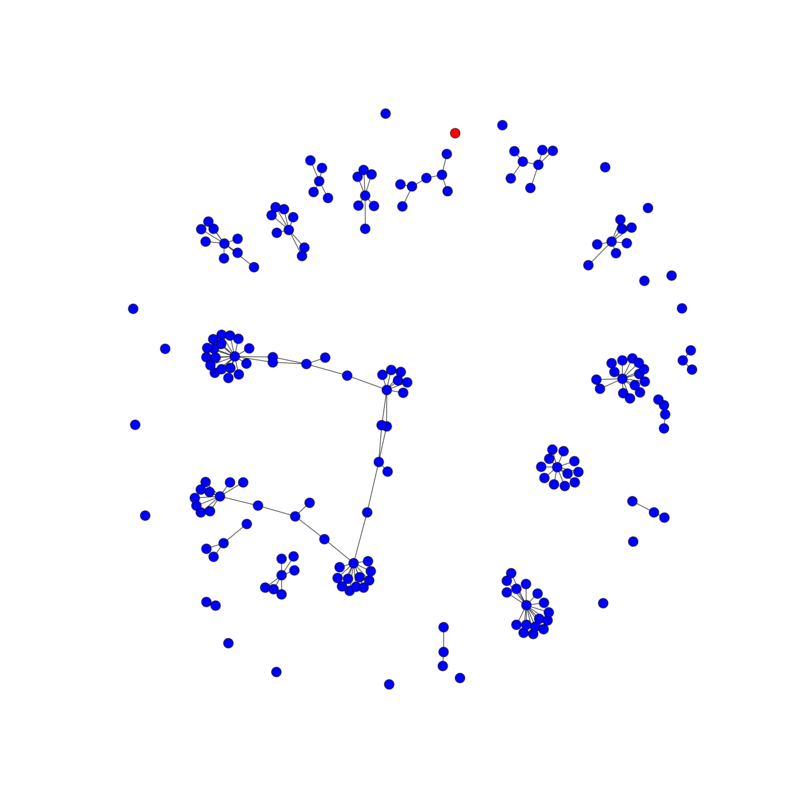
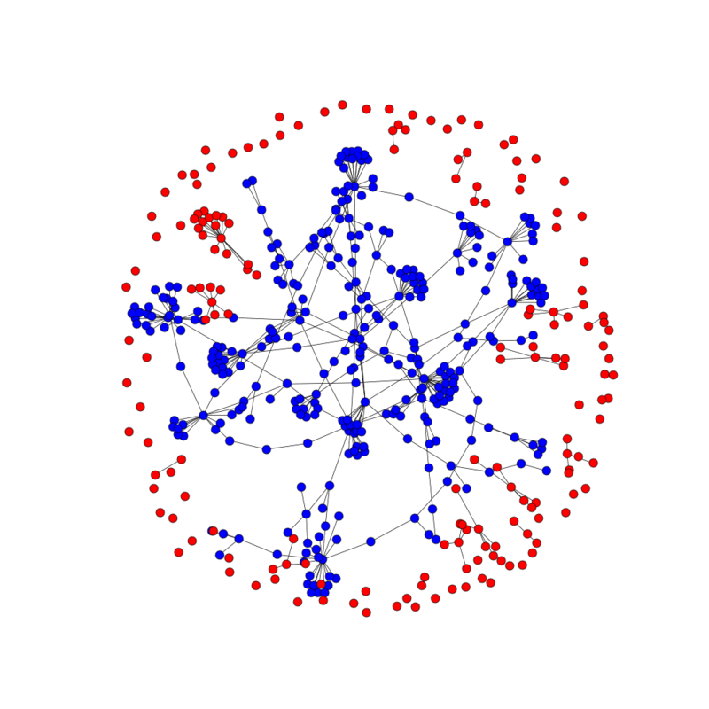

# The Infection Problem
Say you have a service that's used by educators, both inside and outside the classroom by mentors and students. You want to roll out an update to the service but ideally a mentor and a student will always have the same version, to avoid confusing differences in the interface. A person can have both mentor and student relationships with other people, so there's a potentially complex connected graph of all users. What's the best way to roll out the update?

### A word about modeling the real world
There are a number of types of site users we're going to model:
1) classrooms: one mentor and many students
2) singletons: people who use the service with no connections to anyone else
3) poly-connected users: people who could have several mentors, students, or both

Changing the distribution of which nodes are which changes the network topology quite a bit. For example, if we make much more than 10% of nodes poly-connected, we'll pretty quickly end up with a single graph and run out of singletons. With classrooms, we only add a node as a student if that node doesn't currently have any other relations, which makes classrooms more self-contained (which probably better reflects reality).

The generation function tends to generate many unconnected users, a number of very small graphs, and several small-world networks. This should reflect reality enough for our purposes.

### Total graph infection
Our first algorithm is just to take any given graph and infect all the users in it. Here's the total infection algorithm at work on the largest connected graph:

This is great, but doesn't give us a whole lot of control over how many users are updated--it's just however many are in the graph of the user we pass to the algorithm. We'll probably want to infect some number of users.

### Limited number infection
Our limited infection algorithm is given a target of users to update. In this version, we guarantee that a student-mentor pair will always be updated at the same time, so we can't guarantee that we'll hit the exact target. The algorithm works pretty well as long as it has small graphs or singletons to infect. Here's a graph of 200 where the algorithm is able to infect 95 of the target 100 users:

But the algorithm starts to have a large error when the target gets closer to the total number of nodes, because there are only bigger connected graphs left. Here, the algorithm is only able to infect 186 out of the target 499 users (on a graph of 500), because the biggest graph is 314 nodes big:

### Limited number infection: exact
Okay, so what if we want to infect an exact number of users? We can do this by infecting clusters at a time, which is both simple and makes it more likely that classrooms will be updated all at once. This algorithm also guarantees that if a mentor is updated, all their students will be updated at the same time.

This still leaves a lot of edges between nodes with different versions. 
