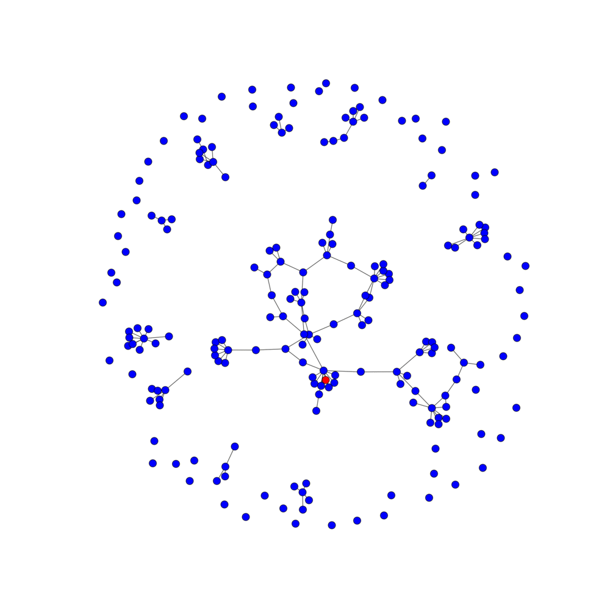

The total infection algorithm at work on the largest connected graph:

Total infection running on a (hopefully) more realistic graph:

Limited infection algorithm works pretty well as long as it has small graphs or singletons to infect. Here's a graph of 200 where the algorithm is able to infect 95 of the target 100 users:

But the algorithm starts to have large errors when the target gets closer to the total number of nodes, because there are only bigger connected graphs left. Here, the algorithm is only able to infect 186 out of the target 499 users (on a graph of 500):

Here, we allow for some of a graph to be updated so we can exactly hit our target. We do this by infecting clusters at a time, to make it more likely that classrooms will be updated all at once. This algorithm also guarantees that if a mentor is updated, all their students will be updated at the same time.

