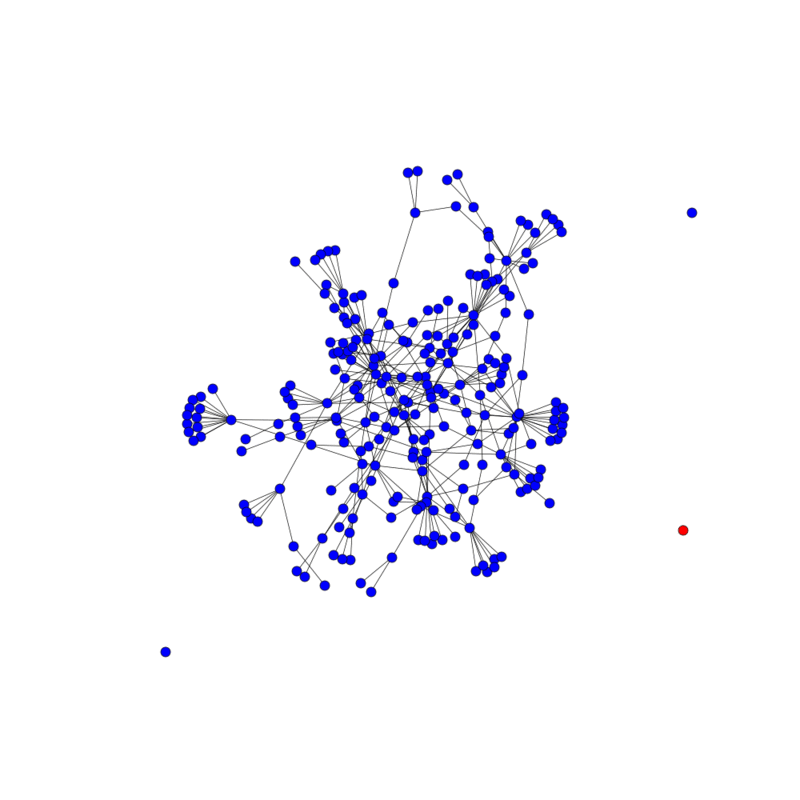

# The Infection Problem
Say you have a service that's used by educators, both inside and outside the classroom by mentors and students. You want to roll out an update to the service but ideally a mentor and a student will always have the same version, to avoid confusing differences in the interface. A person can have both mentor and student relationships with other people, so there's a potentially complex connected graph of all users. What's the best way to roll out the update?

### A word about modeling the real world
There are a number of types of site users we're going to model:
1) Classrooms: one mentor and many students
2) Singletons: people who use the service with no connections to anyone else
3) Poly-connected users: people who could have several mentors, students, or both

Changing the distribution of which nodes are which changes the network topology quite a bit. For example, if we make much more than 10% of nodes poly-connected, we'll pretty quickly end up with a single graph and run out of singletons. With classrooms, we only add a node as a student if that node doesn't currently have any other relations, which makes classrooms more self-contained (which probably better reflects reality).

The generation function tends to generate many unconnected users, a number of very small graphs, and several small-world networks. This should reflect reality enough for our purposes.

### Total graph infection
Our first algorithm is just to take any given graph and infect all the users in it. Here's the total infection algorithm at work on the largest connected graph:

This is great, but doesn't give us a whole lot of control over how many users are updated--it's just however many are in the graph of the user we pass to the algorithm. We'll probably want to infect some number of users.

### Limited number infection
Our limited infection algorithm is given a target of users to update. In this version, we guarantee that a student-mentor pair will always be updated at the same time, so we can't guarantee that we'll hit the exact target. But we can get pretty close, usually, if we start by updating the biggest graphs that won't put us over our target, and then when we run out of those switch to the smallest graphs.

Most of the updated users are part of the biggest graph, but at the end we add in a few singletons to get up to the target number.

### Limited number infection: exact
We might have one big connected graph, though. In order to get an exact number of users updated in that case, we need to only update parts of a connected graph. We can do this by infecting clusters at a time, which is both simple and makes it more likely that classrooms will be updated all at once. This algorithm makes it likely that if a mentor is updated, all their students will be updated at the same time.

This still leaves a lot of edges between nodes with different versions.

### Further work
A metric of how bad a method is to divide up a graph into updated / not updated nodes is how many edges cross the version border. Counting those as we're deciding which next clusters to update in a graph and only updating clusters that add few, if any, new crossing edges might get the algorithm to be a lot better. There's also the NP-hard problem of general graph partitioning we could tackle if we really wanted the optimal solution.
